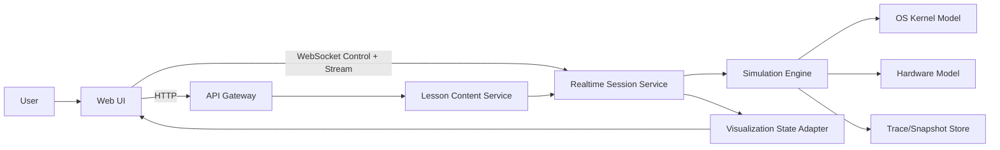
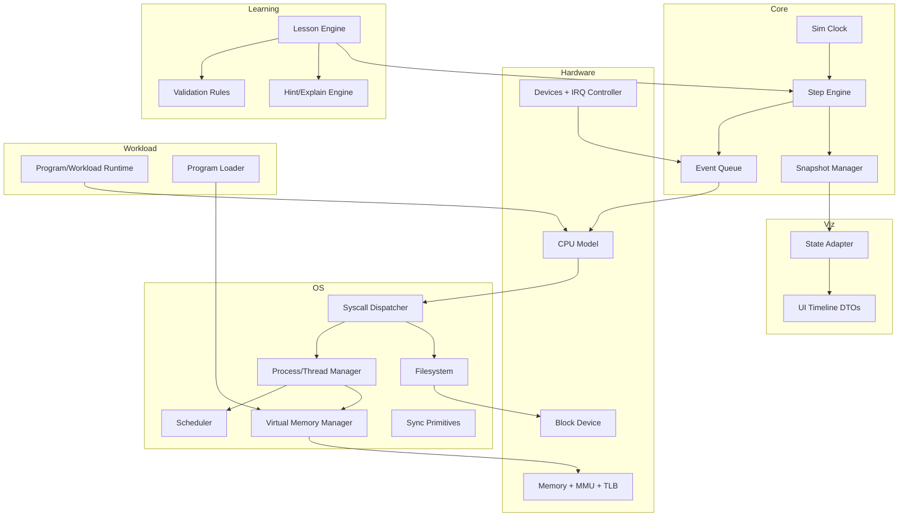
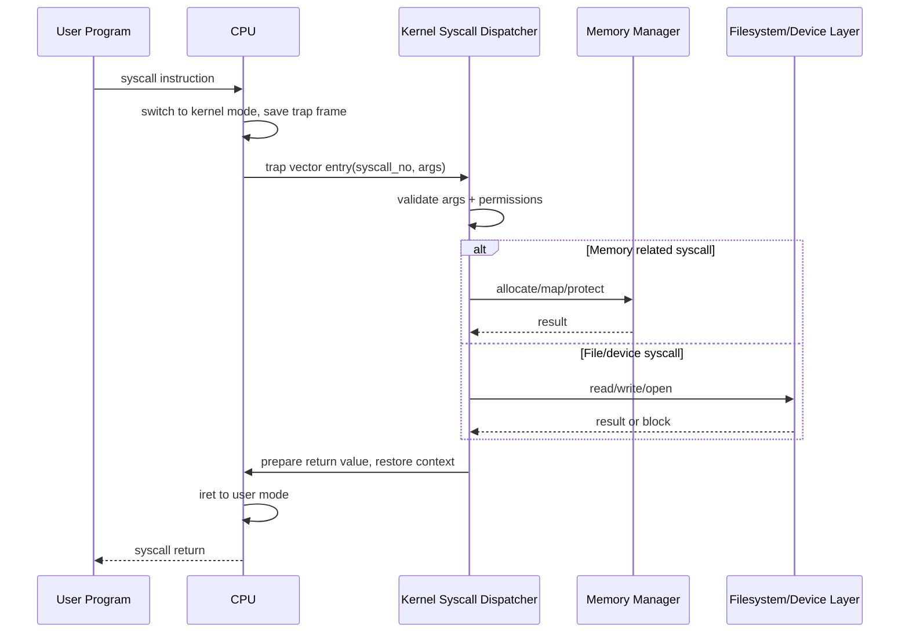
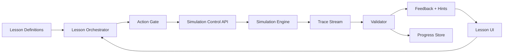
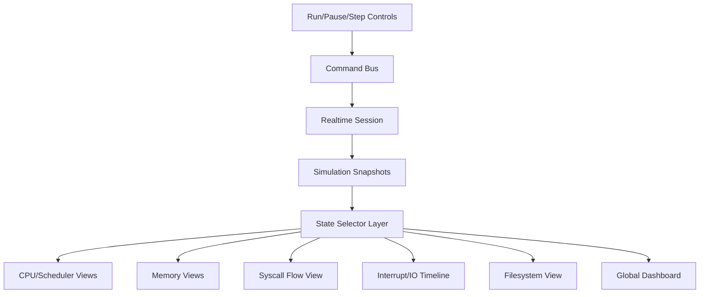

# Production Plan: Interactive Web-Based OS Simulator (OSTEP-Aligned)

## 0) Minimum Skills You Need (As Few As Possible)

If you want the smallest practical skill set for a solo build with AI agents:

1. **Go fundamentals**: interfaces, structs, slices/maps, goroutines/channels, testing.
2. **One frontend framework**: React + TypeScript basics (state, components, hooks).
3. **State machines and event-driven design**: deterministic simulation loops.
4. **Basic OS concepts**: processes, scheduling, virtual memory, syscalls, filesystems (you will learn deeper while building).
5. **Tooling discipline**: Git, tests, linting, CI.

Everything else can be learned incrementally and delegated to AI for speed.

---

## 1) High-Level System Architecture

### Recommended Stack (with tradeoffs)

- **Backend/Simulation**: Go
  - Pros: deterministic performance, simple concurrency model, strong test tooling.
  - Cons: less native UI ecosystem; need clear API boundary.
- **Frontend**: React + TypeScript + SVG/Canvas hybrid
  - Pros: excellent component model for interactive teaching UX.
  - Cons: requires careful state synchronization with simulation timeline.
- **Transport**: WebSocket (bi-directional control + event stream), HTTP for lesson/content assets
  - Pros: real-time step/run/rewind interactions.
  - Cons: protocol versioning needed early.
- **Storage**: local JSON/YAML lesson packs + optional SQLite for progress
  - Pros: low ops burden, easy reproducibility.
  - Cons: multi-user cloud later requires migration planning.

### Component Responsibilities

- **Web UI**: lesson progression, controls (run/pause/step/reset), visualizations.
- **API Gateway**: session lifecycle, command validation, auth (later), lesson fetch.
- **Simulation Engine**: deterministic clock, event queue, replay trace.
- **Kernel Model**: process/thread, scheduler, VM, syscall handlers, FS abstraction.
- **Hardware Model**: CPU, memory, disk, devices, interrupts.
- **Lesson Engine**: goals, validation, hints, branching, progress.
- **Trace Store**: event logs/snapshots for replay and regression testing.



---

## 2) Internal Simulator Architecture

Design for deterministic core + pluggable subsystems.



Layer rules:
- Hardware never imports lesson/UI code.
- Kernel depends on hardware interfaces only.
- Lesson engine observes state/events; does not mutate internals directly (uses command API).
- Visualization adapter reads immutable snapshots.

---

## 3) Hardware Simulation (Flow-Accurate, Simplified)

### CPU
- Registers: `PC`, `SP`, general-purpose regs, flags, mode bit (`user/kernel`).
- Trap flow: syscall/trap instruction raises synchronous exception.
- Interrupt flow: timer/device interrupts injected via IRQ controller.
- Context switch triggers: quantum expiry, blocking syscall, higher-priority wakeup.

### Memory
- Physical memory as frame array.
- Per-process page table (single-level for MVP; multi-level optional later).
- TLB cache with simple replacement (FIFO).
- Permissions: R/W/X + user/kernel bits.
- Faults: invalid page, permission fault, not-present page.

### Disk / Storage
- Block device interface: `ReadBlock`, `WriteBlock`.
- Latency model: deterministic fixed + optional jitter profile by scenario.
- Queue depth and completion interrupt.

### Devices
- Required: disk + terminal/console device.
- Interrupt-driven completion; optional DMA later.

### Clock / Event Queue
- Monotonic simulation tick.
- Priority queue ordered by `(tick, sequence)` for stable determinism.
- Replay via command log + seed + snapshots.

---

## 4) OS Model (Detailed, Central)

### System Call Path



### Processes and Threads
- PCB fields: PID, state, registers, address space ref, open files, scheduling metadata.
- Thread model:
  - MVP: one thread per process.
  - V1: kernel threads with shared address space.
- Process states: `new -> ready -> running -> blocked -> ready -> terminated`.

### Scheduling
- Implement and compare:
  - FIFO: simple baseline, poor interactivity.
  - Round Robin: fairness via quantum.
  - MLFQ: responsiveness + starvation controls.
- UI comparison: same workload replayed with policy switch; aligned Gantt and metrics panel.

### Virtual Memory
- Address space per process.
- Demand paging with page fault handler.
- Replacement policy: FIFO in MVP, Clock/LRU approximation in V1.
- Optional swap in V1.1 only if lesson goals need it.

### Synchronization
- Mutex, spinlock, semaphore, condition variable.
- Explicit wait queues per primitive for visualization.

### Deadlock
- Teaching scenario: circular wait with two locks/resources.
- Choose **detection** for clarity: wait-for graph cycle detection each N ticks.
- Visualize graph nodes/edges + blocked stack traces.

### Filesystem
- Inodes + directories + block mapping (direct pointers only in MVP).
- Path resolution, open file table, per-process fd table.
- Optional buffer cache in V1.

### Program Loader
- Load segments: text, data, bss, stack.
- Initialize page mappings and entrypoint.
- Produce initial process memory map visualization.

---

## 5) Software / Workload Model

### Recommendation

Use a **small instruction DSL + JSON scenario wrapper**.

- **DSL core (best teaching control)**
  - Deterministic pseudo-instructions: `COMPUTE n`, `SYSCALL read`, `LOCK m1`, `UNLOCK m1`, `ALLOC pages`.
  - Pros: readable, pedagogical, easy tracing.
  - Cons: needs interpreter.
- **JSON wrapper**
  - Defines processes, arrival times, priorities, seeds, device latency profile.
  - Pros: scenario authoring by data, no code compile.

Why not mini-ISA first?
- Too much effort on instruction semantics unrelated to OS learning goals.

### Workload Examples
- CPU-bound: long compute bursts; compare FIFO vs RR.
- I/O-bound: frequent disk reads; shows blocking/unblocking.
- Race condition: two workers increment shared counter without lock, then with mutex.
- Memory pressure: overcommit frames to force faults and replacement.
- Filesystem path: open/read/write/close with inode/block tracing.

---

## 6) Interactive Learning System (Learn Git Branching Style)

### Core Features
- Step-by-step controls: run, pause, step tick, step event, rewind, reset.
- Predict-then-run: user picks expected outcome, then simulator executes.
- Guided goals: e.g., “Reduce average turnaround by tuning quantum”.
- Validation: state predicates + trace pattern checks.
- Hints: progressive (`nudge -> concept -> explicit fix`).
- Progress tracking: lesson completion + score + failed attempts.

### Lesson Model
- `Lesson` contains ordered `Stages`.
- Each stage binds:
  - initial scenario snapshot,
  - allowed user actions,
  - success/failure validators,
  - explanation content.

### Exercise Model
- Types: multiple-choice prediction, parameter tuning, direct command tasks.
- Grading via deterministic end-state checks and key timeline events.



---

## 7) Visualization System

### Rendering Choice
- **SVG for structural diagrams** (process graph, page tables, FS tree): best inspectability.
- **Canvas for dense timelines** (Gantt, interrupts): better performance.
- **DOM for controls/text explanations**.
- Avoid WebGL initially; complexity not justified for MVP.

### Required Views
- CPU/scheduling: Gantt timeline + state transitions.
- Memory: per-process VA map, page table, physical frames, fault events.
- Syscalls: user->kernel->handler path animation on events.
- Interrupt/I/O: request/completion timeline with IRQ markers.
- Filesystem: inode/dir/block map and read/write traversal.
- Global dashboard: CPU mode, running PID, ready queue, blocked queue, memory pressure, disk queue.



---

## 8) OSTEP Coverage Plan

| OSTEP Area | Simulator Feature | Interactive Scenario | Learner Outcome |
|---|---|---|---|
| Virtualization (CPU) | Process abstraction + scheduler | Compare FIFO/RR/MLFQ on same jobs | Understand fairness, response time, throughput tradeoffs |
| Virtualization (Memory) | Page tables + TLB + faults | Trigger faults under pressure, switch replacement policy | Understand translation, locality, and fault cost |
| Concurrency | Locks/semaphores/condvars | Fix race, then explore deadlock | Understand mutual exclusion, waiting, deadlock conditions |
| Persistence | Inodes/dirs/blocks | Trace file read/write path | Understand naming, metadata, block mapping |
| I/O & Interrupts | Device queue + IRQ handling | Observe blocking syscall and wakeup | Understand async completion and kernel wake path |

---

## 9) Go-Oriented Interfaces (Pseudocode)

```go
package sim

type Tick uint64

type Event interface {
    At() Tick
    Seq() uint64
    Apply(ctx *Context) error
    Name() string
}

type EventQueue interface {
    Push(Event)
    Pop() (Event, bool)
    PeekTick() (Tick, bool)
}

type CPU interface {
    Step(ctx *Context) error
    RaiseInterrupt(irq int)
    Trap(sysno int, args []uint64) error
    LoadContext(trap TrapFrame)
    SaveContext() TrapFrame
}

type PCB struct {
    PID        int
    State      ProcState
    Trap       TrapFrame
    AddrSpace  AddressSpace
    OpenFiles  map[int]FileHandle
    SchedMeta  SchedMeta
}

type Scheduler interface {
    Enqueue(pid int)
    Dequeue() (pid int, ok bool)
    OnTick(running int)
    OnBlock(pid int)
    OnWake(pid int)
    Metrics() SchedMetrics
}

type MemoryManager interface {
    Translate(pid int, va uint64, access AccessType) (pa uint64, err error)
    HandlePageFault(pid int, va uint64, access AccessType) error
    Map(pid int, va uint64, frame int, perm Perm) error
    Unmap(pid int, va uint64) error
}

type AddressSpace interface {
    Lookup(va uint64) (PTE, bool)
    Set(va uint64, pte PTE)
}

type Filesystem interface {
    Open(pid int, path string, flags int) (fd int, err error)
    Read(pid, fd int, n int) ([]byte, error)
    Write(pid, fd int, data []byte) (int, error)
    Close(pid, fd int) error
}

type Device interface {
    ID() string
    Submit(req IORequest) error
    Tick(now Tick) []Interrupt
}

type SyscallDispatcher interface {
    Handle(pid int, sysno int, args []uint64) (ret uint64, errno int)
}

type LessonEngine interface {
    Load(lessonID string) error
    CurrentStage() Stage
    Validate(snapshot Snapshot, trace []TraceEvent) ValidationResult
    Next(action LearnerAction) (Feedback, error)
}
```

Interface design rules:
- No UI types inside simulator packages.
- Snapshot DTOs are immutable.
- Seeded deterministic randomness only through one injected RNG.

---

## 10) Staged Development Roadmap (Solo-Realistic)

### Stage 1: Deterministic Core
- Goal: reproducible engine loop.
- Scope: clock, event queue, snapshots, replay log.
- Deliverables: CLI runner + golden trace tests.
- Validation: same seed+commands => identical hash.
- Risks: hidden nondeterminism (map iteration, wall clock).

### Stage 2: Process + CPU Basics
- Goal: run pseudo-programs and state transitions.
- Scope: PCB, trap frame, run/blocked lifecycle.
- Deliverables: process table + step execution UI panel.
- Validation: state machine tests.
- Risk: overbuilding instruction semantics.

### Stage 3: Scheduling + Visualization
- Goal: teach CPU virtualization.
- Scope: FIFO, RR, MLFQ + Gantt chart.
- Deliverables: policy switch and metric comparison.
- Validation: known workload expected metrics.
- Risk: UI overfit before engine stability.

### Stage 4: Syscalls + Trap Path
- Goal: clear user/kernel flow.
- Scope: syscall dispatcher + trap/return view.
- Deliverables: `open/read/write/sleep/exit` minimal set.
- Validation: sequence trace assertions.
- Risk: leaky abstractions between CPU and kernel.

### Stage 5: Virtual Memory
- Goal: page table + faults.
- Scope: VA->PA translation, TLB, fault handler, replacement.
- Deliverables: memory views and fault timeline.
- Validation: fault count and frame occupancy tests.
- Risk: too much MMU detail too soon.

### Stage 6: Devices + Interrupts
- Goal: realistic async I/O behavior.
- Scope: disk + terminal device, IRQ controller.
- Deliverables: I/O request/completion visualization.
- Validation: blocked->ready wakeup traces.
- Risk: racey event ordering if queue rules weak.

### Stage 7: Filesystem Core
- Goal: persistence teaching baseline.
- Scope: inode, dir lookup, block map.
- Deliverables: path traversal animation.
- Validation: FS invariant checks.
- Risk: journaling creep (defer).

### Stage 8: Lesson Engine
- Goal: Learn Git Branching style pedagogy.
- Scope: lesson DSL, validators, hints, progress.
- Deliverables: 5 high-value lessons.
- Validation: scenario tests with expected outcomes.
- Risk: content quality bottleneck.

### Stage 9: OSTEP Lesson Pack
- Goal: meaningful chapter coverage.
- Scope: virtualization, memory, concurrency, persistence modules.
- Deliverables: 20-30 guided exercises.
- Validation: pilot run checklist and completion analytics.
- Risk: breadth > depth.

### Stage 10: Polish + Production Tooling
- Goal: maintainable release.
- Scope: docs, CI, release process, profiling, observability.
- Deliverables: v1.0 release candidate.
- Validation: CI green + deterministic regression suite.
- Risk: endless polish loop.

---

## 11) Production Project Structure

```text
/cmd
  /server                # API + websocket entrypoint
  /simcli                # headless runner for tests and debugging
/internal
  /sim                   # clock, events, snapshots, replay
  /hardware              # cpu, mmu, memory, devices, disk
  /kernel                # proc, sched, syscall, vm, sync, fs
  /workload              # DSL parser/interpreter + scenario runtime
  /lessons               # lesson DSL, validators, hints, progression
  /transport
    /http                # REST endpoints
    /ws                  # realtime control/event stream
  /adapters
    /viz                 # sim snapshot -> UI DTOs
  /platform
    /logging             # structured logs
    /config              # config loading/validation
/web
  /app                   # React app
  /components            # visual modules
  /state                 # client store and selectors
  /assets                # lesson media
/docs
  /architecture
  /lessons
  /ostep-mapping
/examples
  /scenarios
/scripts
  /ci
  /dev
/tests
  /golden                # replay traces
  /integration
```

Boundary rules:
- `internal/sim`, `internal/kernel`, `internal/hardware` are domain core.
- transport and viz adapters depend inward, never vice versa.

---

## 12) Tooling and Engineering Standards

### Required
- Build: `go build ./...`, frontend `pnpm build`.
- Dependencies: Go modules + `pnpm` lockfile.
- Formatting: `gofmt`, `goimports`, `prettier`.
- Linting: `golangci-lint`, `eslint`.
- Testing: `go test`, frontend unit tests (Vitest/Jest), Playwright for key flows.
- Docs: MkDocs or Docusaurus for architecture + lessons.

### Suggested
- CI: GitHub Actions matrix (Go + Node + deterministic replay job).
- Pre-commit hooks: format, lint, quick tests.
- Dev env: Dev Container + `make dev`.
- Versioning: SemVer with changelog automation.
- Observability: structured event logs + trace IDs + simulation hash.
- Codegen: only for API client types (OpenAPI/TS) if API grows.

---

## 13) Testing Strategy (Simulator-Critical)

- Deterministic tests: replay command logs; assert identical trace hashes.
- Unit tests:
  - scheduler policy decisions,
  - page table translation,
  - syscall argument validation,
  - filesystem inode/block functions.
- Integration tests:
  - syscall -> FS/device -> interrupt -> wakeup path,
  - context switch on timer tick,
  - deadlock detection cycle.
- Scenario tests (lesson level): expected objective satisfaction and feedback text keys.
- Snapshot/trace tests: compare canonical event sequence (with stable IDs).
- Property-based tests (useful):
  - scheduler invariants (no lost runnable process),
  - memory invariants (frame ownership consistency),
  - filesystem invariants (reachable inode graph).

Specific correctness checks:
- Scheduling: waiting/turnaround metrics for known workloads.
- Page faults: expected fault counts under fixed reference strings.
- Syscall flow: mandatory trap-save-dispatch-return ordering.
- Filesystem consistency: directory entries map to valid inodes.
- Deadlock: wait-for cycle detected and reported deterministically.

---

## 14) MVP vs Version 1

### MVP (smallest useful teaching product)
- Includes: deterministic core, processes, FIFO+RR, basic syscalls, single-level paging with faults, disk device interrupts, inode-lite FS, lesson engine basics, 8-10 lessons.
- Defers: MLFQ tuning UI depth, swap, multi-threading, journaling, advanced cache models.
- Why: delivers strong OSTEP foundations quickly with manageable complexity.

### Version 1
- Includes: MLFQ, richer VM (replacement variants), sync primitives + deadlock lessons, improved FS visualization, robust progress tracking, 20-30 lessons, polished UX.
- Defers: distributed systems extensions, full POSIX compatibility, binary ISA execution.
- Why: broad OSTEP coverage while staying focused on educational simulator goals.

---

## 15) Design Principles and Constraints (Enforced)

- Accuracy over visuals: every animation must correspond to real simulator events.
- Determinism first: no wall-clock dependence in domain logic.
- Separation of concerns: domain core independent from transport/UI.
- Pedagogy first: each feature must map to a learning objective.
- Scope discipline: defer realism that does not improve understanding.
- Extensibility: plugin-like policies (scheduler/replacement) and scenario packs.

---

## Immediate Next Actions (Start Building This Week)

1. Scaffold repo structure and CI skeleton.
2. Implement Stage 1 deterministic core and golden-trace test harness.
3. Build minimal web control panel (run/pause/step/reset + event log).
4. Add process model + RR scheduler + first visualization (Gantt).
5. Author first lesson: “Predict RR scheduling outcome”.
