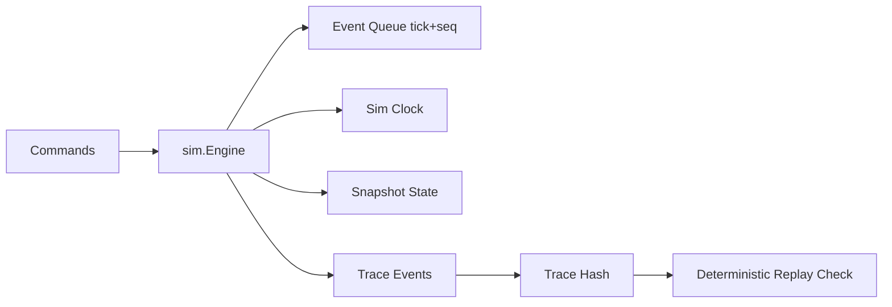
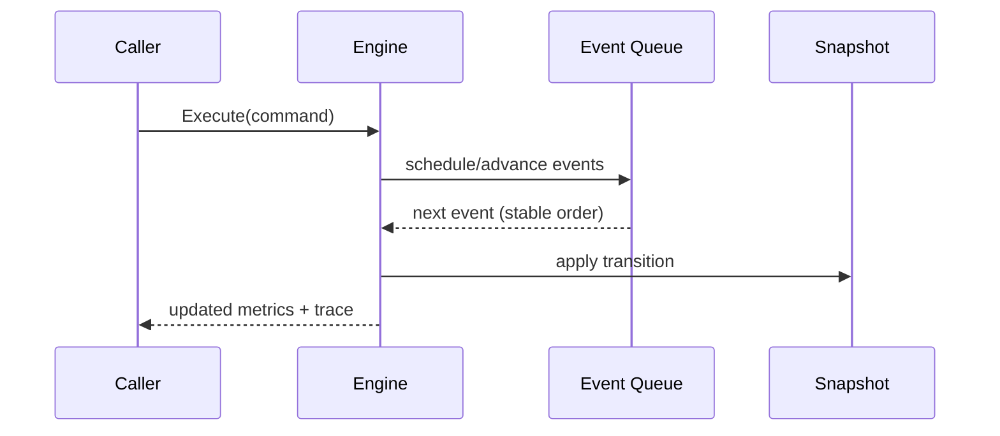

# 01) Simulator Core

Deterministic engine with replay-safe state transitions.

```mermaid
flowchart LR
  CMD[Commands] --> ENG[sim.Engine]
  ENG --> EQ[Event Queue tick+seq]
  ENG --> CLK[Sim Clock]
  ENG --> SNAP[Snapshot State]
  ENG --> TRACE[Trace Events]
  TRACE --> HASH[Trace Hash]
  HASH --> REPLAY[Deterministic Replay Check]
```

```mermaid
sequenceDiagram
  participant U as Caller
  participant E as Engine
  participant Q as Event Queue
  participant S as Snapshot
  U->>E: Execute(command)
  E->>Q: schedule/advance events
  Q-->>E: next event (stable order)
  E->>S: apply transition
  E-->>U: updated metrics + trace
```
