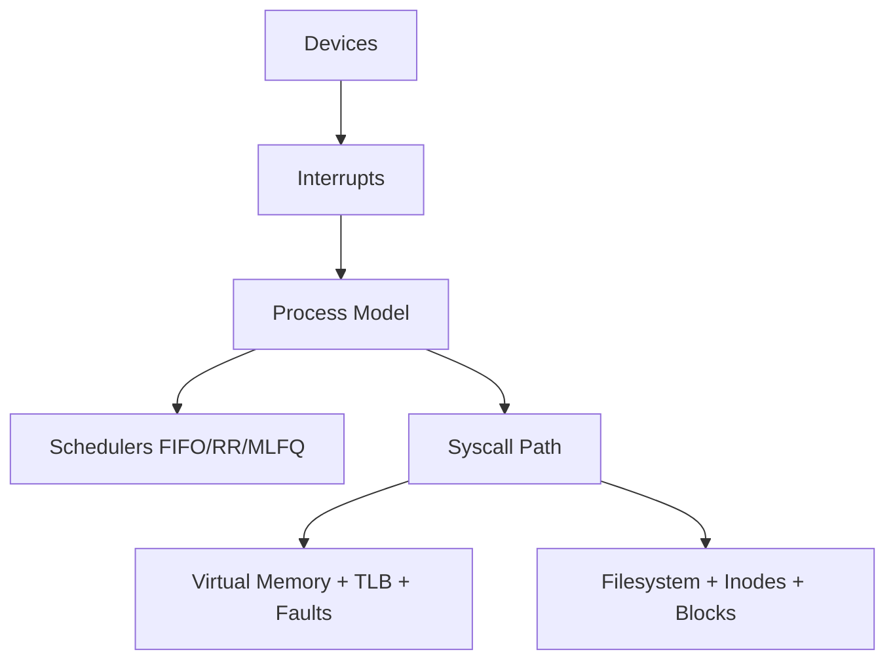
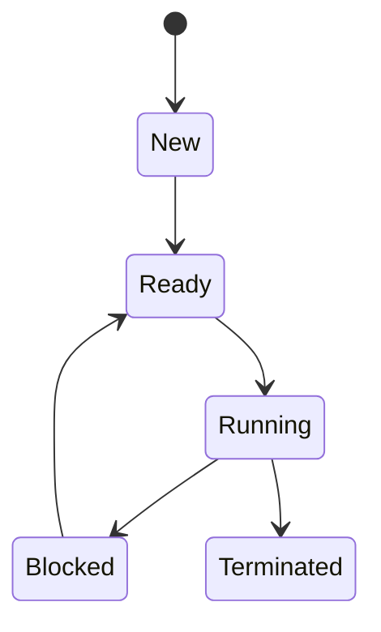

# 02) Kernel Subsystems

Implemented OS teaching path: process/scheduling, VM, syscalls, IRQ/devices, filesystem.

```mermaid
flowchart TB
  PROC[Process Model] --> SCHED[Schedulers FIFO/RR/MLFQ]
  PROC --> SYSC[Syscall Path]
  SYSC --> VM[Virtual Memory + TLB + Faults]
  SYSC --> FS[Filesystem + Inodes + Blocks]
  DEV[Devices] --> IRQ[Interrupts]
  IRQ --> PROC
```

```mermaid
stateDiagram-v2
  [*] --> New
  New --> Ready
  Ready --> Running
  Running --> Blocked
  Blocked --> Ready
  Running --> Terminated
```
