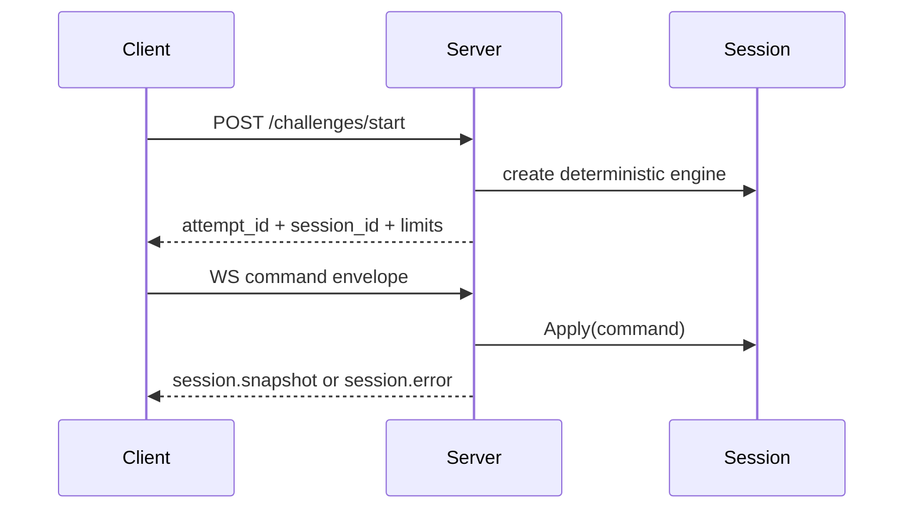

# 03) Realtime Transport

HTTP + WebSocket transport over deterministic simulator sessions.

```mermaid
flowchart LR
  FE[Frontend] -->|GET /lessons| API[cmd/server]
  FE -->|POST /challenges/start| API
  FE -->|POST /challenges/grade| API
  FE <-->|WS /ws/{sessionID}| API
  API --> SM[SessionManager]
  SM --> ENG[sim.Engine]
  API --> LE[lessons.Engine]
```


