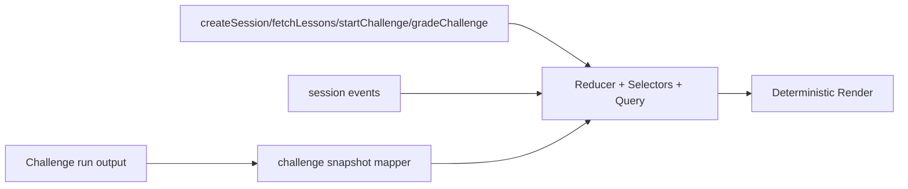

# 04) Web UI

React + TypeScript challenge interface for OSTEP lesson-stage workflow.

```mermaid
flowchart TB
  APP[Challenge App] --> CHAL[/challenge]
  CHAL --> LESSON[Lesson Stage Runner]
  CHAL --> CVIZ[Challenge Snapshot]
  CHAL --> VIZ
  VIZ --> TL[Scheduler Timeline]
  VIZ --> MEM[Memory Panel]
  VIZ --> Q[Process Queues]
  VIZ --> PM[Process Metrics]
```


