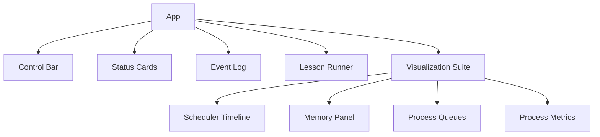
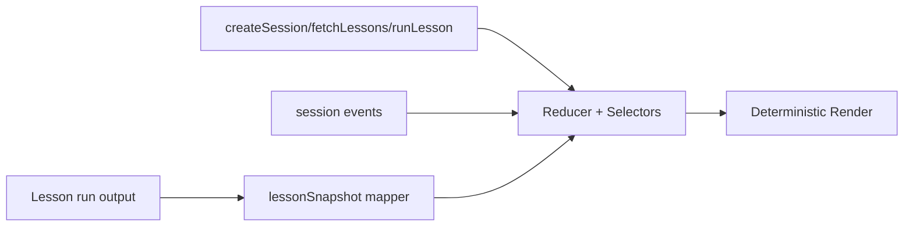

# 04) Web UI

React + TypeScript control plane with live and lesson-replay visualizations.

```mermaid
flowchart TB
  APP[App] --> CTRL[Control Bar]
  APP --> STATUS[Status Cards]
  APP --> LOG[Event Log]
  APP --> LESSON[Lesson Runner]
  APP --> VIZ[Visualization Suite]
  VIZ --> TL[Scheduler Timeline]
  VIZ --> MEM[Memory Panel]
  VIZ --> Q[Process Queues]
  VIZ --> PM[Process Metrics]
```

```mermaid
flowchart LR
  HTTP[createSession/fetchLessons/runLesson] --> STATE[Reducer + Selectors]
  WS[session events] --> STATE
  LES[Lesson run output] --> MAP[lessonSnapshot mapper]
  MAP --> STATE
  STATE --> UI[Deterministic Render]
```
