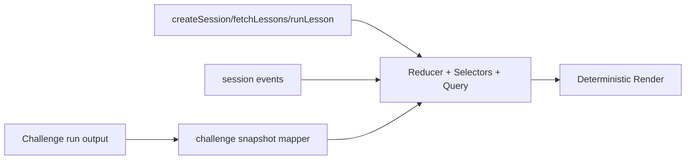

# 04) Web UI

React + TypeScript control plane organized into two learning modes: Sandbox and Challenge.

```mermaid
flowchart TB
  APP[App Router by URL mode] --> SBX[/sandbox]
  APP --> CHAL[/challenge]
  SBX --> CTRL[Control Bar]
  SBX --> STATUS[Status Cards]
  SBX --> LOG[Event Log]
  CHAL --> LESSON[Challenge Runner]
  CHAL --> CVIZ[Challenge Snapshot]
  SBX --> VIZ
  VIZ --> TL[Scheduler Timeline]
  VIZ --> MEM[Memory Panel]
  VIZ --> Q[Process Queues]
  VIZ --> PM[Process Metrics]
```


