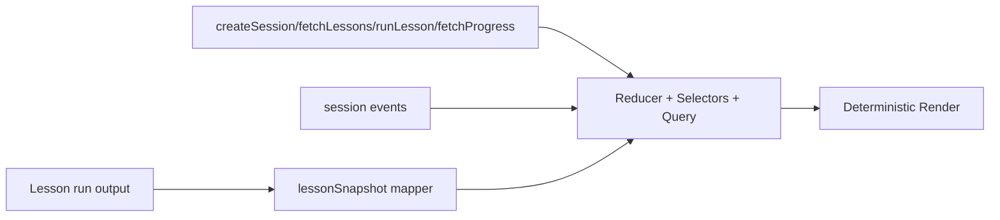

# 04) Web UI

React + TypeScript control plane organized into explicit learning modes: Path, Sandbox, Challenge, and Progress.

```mermaid
flowchart TB
  APP[App Router by URL mode] --> PATH[/path]
  APP --> SBX[/sandbox]
  APP --> CHAL[/challenge]
  APP --> PROG[/progress]
  SBX --> CTRL[Control Bar]
  SBX --> STATUS[Status Cards]
  SBX --> LOG[Event Log]
  PATH --> LESSON[Lesson Stage Runner]
  CHAL --> LESSON
  PATH --> VIZ[Visualization Suite]
  SBX --> VIZ
  VIZ --> TL[Scheduler Timeline]
  VIZ --> MEM[Memory Panel]
  VIZ --> Q[Process Queues]
  VIZ --> PM[Process Metrics]
  PROG --> ANA[Progress + Weak Concepts]
```


