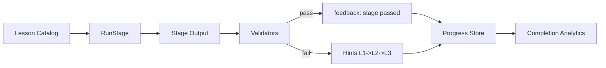
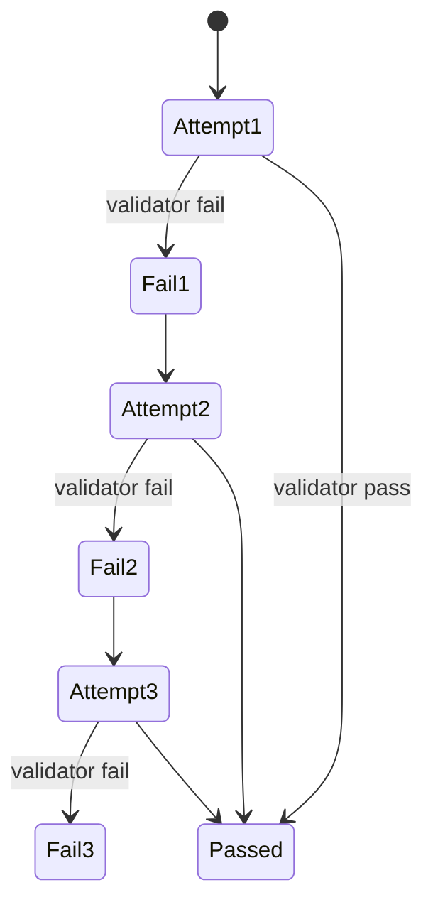

# 05) Lesson Engine

20-lesson OSTEP-aligned catalog with validators, hint progression, and analytics.

```mermaid
flowchart LR
  CAT[Lesson Catalog] --> RUN[RunStage]
  RUN --> OUT[Stage Output]
  OUT --> VAL[Validators]
  VAL -->|pass| PASS[feedback: stage passed]
  VAL -->|fail| HINT[Hints L1->L2->L3]
  PASS --> PROG[Progress Store]
  HINT --> PROG
  PROG --> ANA[Completion Analytics]
```

```mermaid
stateDiagram-v2
  [*] --> Attempt1
  Attempt1 --> Fail1: validator fail
  Fail1 --> Attempt2
  Attempt2 --> Fail2: validator fail
  Fail2 --> Attempt3
  Attempt3 --> Fail3: validator fail
  Attempt1 --> Passed: validator pass
  Attempt2 --> Passed
  Attempt3 --> Passed
```
