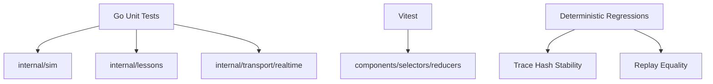
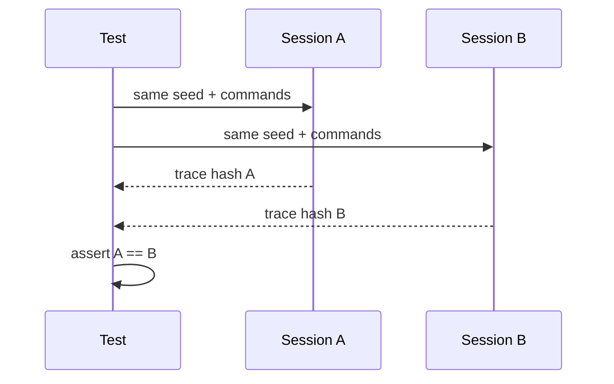

# 06) Testing and Determinism

Coverage is split across simulator, transport, lessons, and frontend unit tests.

```mermaid
flowchart TB
  UNIT[Go Unit Tests] --> SIM[internal/sim]
  UNIT --> LES[internal/lessons]
  UNIT --> RT[internal/transport/realtime]
  WEB[Vitest] --> UI[components/selectors/reducers]
  DET[Deterministic Regressions] --> HASH[Trace Hash Stability]
  DET --> REPLAY[Replay Equality]
```

```mermaid
sequenceDiagram
  participant T as Test
  participant S1 as Session A
  participant S2 as Session B
  T->>S1: same seed + commands
  T->>S2: same seed + commands
  S1-->>T: trace hash A
  S2-->>T: trace hash B
  T->>T: assert A == B
```
