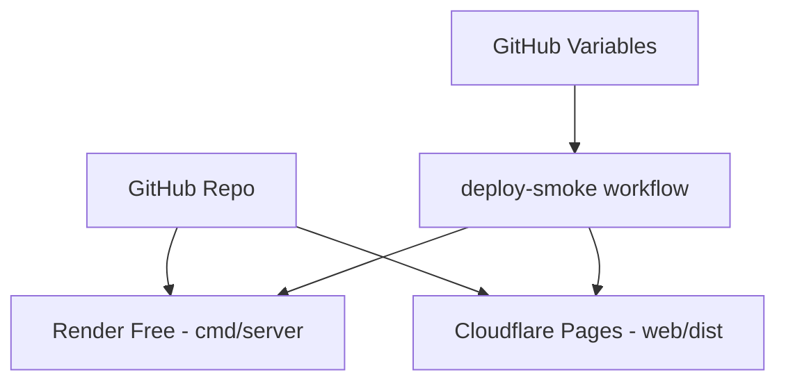

# 07) CI/CD and Free Deploy

CI validates backend + frontend; deploy smoke verifies hosted endpoints.

```mermaid
flowchart LR
  PR[Push/PR] --> CI[ci.yml]
  CI --> GO[Go tests + deterministic suite + build]
  CI --> WEB[web lint + typecheck + vitest + build]
  MAIN[Push main] --> SMOKE[deploy-smoke.yml]
  SMOKE --> API[/healthz /lessons /lessons/run /lessons/progress]
  SMOKE --> UI[/ frontend availability]
```



Reference: `docs/deployment-free.md`.
